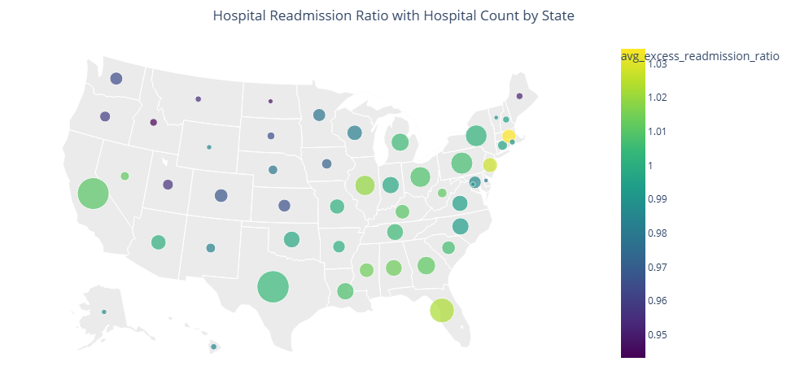
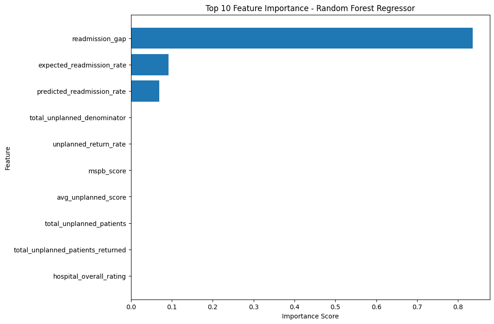
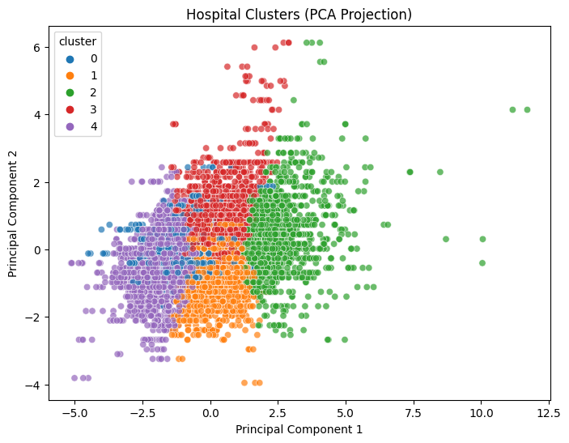

# Hospital Readmission Analytics & Prediction (Lakehouse Project)

## Key Highlights

- End-to-end Lakehouse pipeline (Bronze → Silver → Gold)
- Advanced EDA with geographic visualization
- Clustering + PCA for segmentation
- Regression & Classification modeling
- Feature importance with leakage awareness
- Production-style project structure

## Overview
This project analyzes hospital readmission performance using CMS (Centers for Medicare & Medicaid Services) data.  
It combines data engineering, exploratory analysis, and machine learning within a Databricks Lakehouse architecture to identify patterns and build predictive models for hospital readmission outcomes.  
The workflow follows a Bronze → Silver → Gold pipeline, enabling scalable and production-style data processing.

## Objective
Analyze hospital readmission performance using CMS data and develop predictive models to identify key drivers of readmission outcomes.

## Data Sources

The datasets used in this project are sourced from publicly available CMS (Centers for Medicare & Medicaid Services) and USDA resources.

The project integrates multiple datasets using **Facility ID** as the primary join key and **ZIP code** for geographic enrichment through RUCA classification.

Due to size and licensing considerations, raw data is not included in this repository. The pipeline demonstrates end-to-end processing within the Databricks Lakehouse environment.

| Dataset | Join Key | Description | Rows | Source |
|--------|--------|------------|------|--------|
| HRRP Readmissions | Facility ID | Hospital readmission performance metrics | 18,830 | https://data.cms.gov/provider-data/dataset/9n3s-kdb3 |
| Hospital General Info | Facility ID | Hospital characteristics (ownership, rating, services) | 5,426 | https://data.cms.gov/provider-data/dataset/xubh-q36u |
| Medicare Spending per Beneficiary (MSPB) | Facility ID | Hospital spending and efficiency scores | 4,625 | https://data.cms.gov/provider-data/dataset/rrqw-56er |
| Unplanned Hospital Visits | Facility ID | Return visits and excess days in acute care (EDAC) | 67,046 | https://data.cms.gov/provider-data/dataset/632h-zaca |
| RUCA Codes (2020) | ZIP Code | Urban/rural classification of hospital locations | 41,146 | https://www-tx.ers.usda.gov/media/5442/2020-rural-urban-commuting-area-codes-zip-codes.xlsx |


## Architecture
- **Bronze Layer**: Raw CMS datasets ingested  
- **Silver Layer**: Cleaned and joined datasets  
- **Gold Layer**: Feature-engineered tables for analytics and ML. The Gold layer serves as the foundation for both analytical exploration and machine learning modeling.

## Exploratory Data Analysis
Key analyses performed:
- Distribution of readmission metrics  
- Hospital rating and performance comparisons  
- Geographic analysis using choropleth maps  
- State-level aggregation of readmission ratios  
- Bubble visualizations incorporating hospital counts  

## Clustering & PCA
- Applied K-Means clustering to group hospitals  
- Used PCA for dimensionality reduction and variance analysis  

Identified distinct hospital profiles:
- Large metropolitan hospitals  
- Community hospitals  
- High-cost hospitals  
- Underperforming hospitals  
- High-quality hospitals  

## Machine Learning Models

### Regression
Models:
- Linear Regression  
- Random Forest Regressor  

Target:
- `excess_readmission_ratio`

### Classification
Models:
- Logistic Regression  
- Random Forest Classifier  

Target:
- `high_readmission_flag`

## Model Performance Summary

### Regression Results

| Model             | MAE    | RMSE   | R²    |
|------------------|--------|--------|-------|
| Linear Regression | 0.019 | 0.037 | 0.786 |
| Random Forest     | 0.001 | 0.005 | 0.995 |

Random Forest significantly outperformed linear regression.
The near-perfect performance of Random Forest suggests strong relationships between features and the target variable, potentially influenced by derived CMS metrics.

### Classification Results

| Model              | Accuracy | Precision | Recall | F1    | ROC-AUC |
|-------------------|----------|-----------|--------|-------|--------|
| Logistic Regression | 0.998  | 0.999     | 0.996 | 0.998 | 1.00   |
| Random Forest       | 1.000  | 1.000     | 1.000 | 1.000 | 1.00   |

Both models performed extremely well, with Random Forest slightly outperforming.

## Feature Importance Insights
Top predictors:
- Readmission gap  
- Expected readmission rate  
- Predicted readmission rate  

These variables are derived from CMS methodologies and are closely related to the target variable, which may introduce information overlap rather than representing fully independent drivers.

## Key Visualizations

### Choropleth Map – Readmission Ratio by State
This map highlights geographic variation in hospital readmission performance across states.


---

### Bubble Map – Readmission Ratio with Hospital Count
This visualization combines readmission performance with hospital volume, helping interpret the reliability of state-level averages.



---

### Feature Importance – Random Forest (Regression)
Feature importance shows that readmission-related metrics dominate model predictions, with minimal contribution from geographic variables.



---

### PCA Projection – Hospital Clusters
PCA projection of clustered hospitals reveals distinct groupings based on performance and operational characteristics.



## Key Findings
- Readmission-related metrics dominate predictive performance  
- Random Forest models outperform linear models  
- Geographic and rural indicators have relatively low predictive importance  
- Model performance is extremely high due to strong correlation between features and target  

## Modeling Consideration
Some high-importance features are derived from CMS calculations and are closely tied to the target variable.  
This introduces information overlap (potential leakage), meaning the model is highly predictive but may not fully capture independent causal drivers.

## Future Work
- Remove CMS-derived variables to reduce leakage  
- Incorporate demographic and socioeconomic data (SDOH)  
- Explore time-series modeling for trend analysis  
- Integrate MLflow tracking in a production-enabled environment  

## Tech Stack
- Databricks
- PySpark
- Python (pandas, scikit-learn)
- Delta Lake
- Plotly / Matplotlib

## Repository Notes

- This project was developed in Databricks. Some notebooks are stored in GitHub as `.py` notebook source files through Databricks Git integration, so rendered cell outputs are not always visible directly in GitHub. Key results and visual outputs are included in the README and `screenshots/` folder.
- To showcase outputs and visualizations, selected demo notebooks are also provided in `.ipynb` format within their respective folders.

## Project Structure
```
cms-hospital-lakehouse/
│
├── notebooks/
│ ├── 00_eda
│ ├── 00_eda_demo
│ ├── 01_silver_layer
│ ├── 02_gold_layer
│ ├── 03_clustering_pca
│ ├── 04_ml_modeling
│ ├── 04_ml_modeling_demo
|
├── screenshots/
├── requirements.txt
└── README.md
```

## Author
**Mehmet A. Comert**  
M.S. Data Science